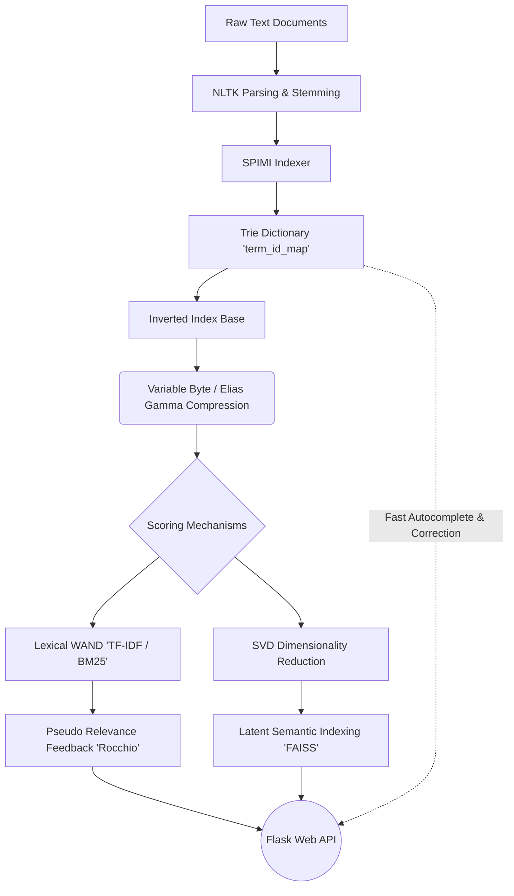
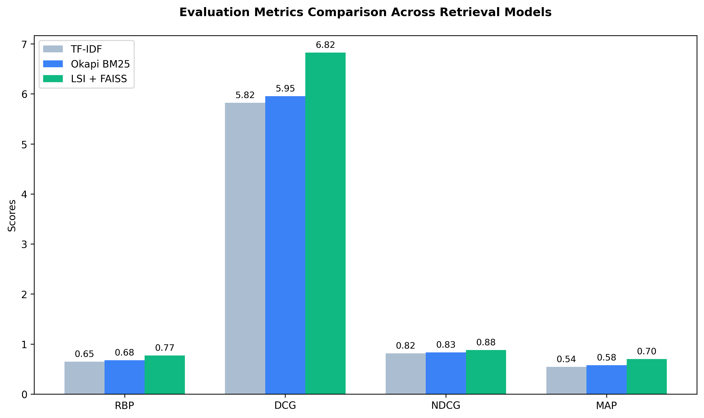
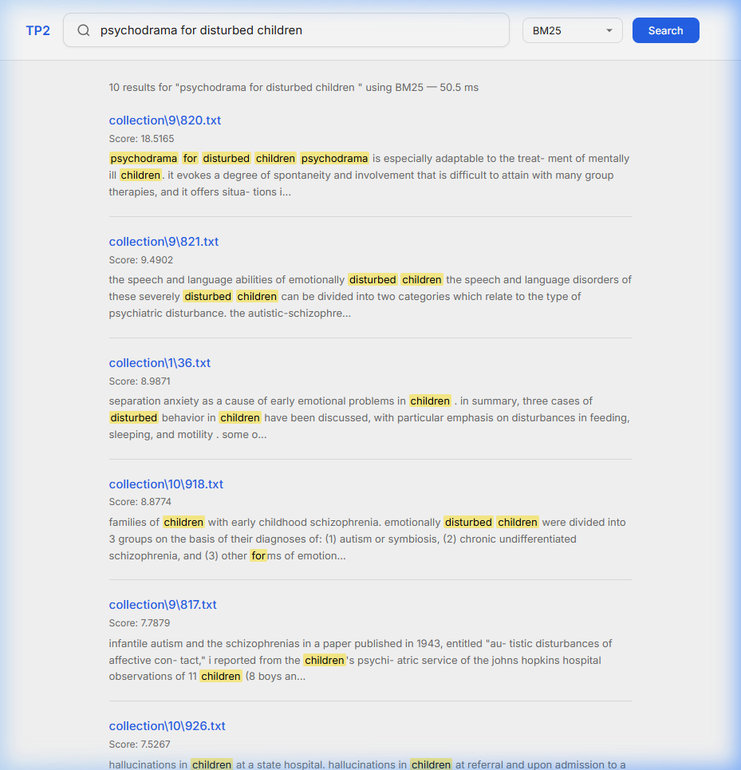

# High-Performance Search Engine

**Author**: Alwie Attar Elfandra  
**NPM**: 2306241726  
**Course**: Temu Balik Informasi (Information Retrieval)  
**Assignment**: Tugas Pemrograman 2 (TP 2)  

---

## Overview

This repository contains a fully functional, high-performance Search Engine built from the ground up using **Blocked Sort-Based Indexing (BSBI)**. The project extends traditional retrieval models with advanced text compression algorithms, state-of-the-art vector similarity search, prefix-trie auto-completion, and a modern web interface.

The core motivation behind this implementation is to provide a comprehensive, extensible platform capable of seamlessly managing thousands of text documents and executing rapid, highly accurate queries.

## Architecture

The following diagram illustrates the data flow and primary architecture of the Search Engine, from physical textual documents up to the web retrieval interface:



---

## Technical Features

### Core Retrieval & Compression Models
- **Okapi BM25 & TF-IDF**: Baseline vector-space and probabilistic retrieval models calibrated with term frequency saturation and document length normalization.
- **Variable Byte Encoding (VBE) & Elias-Gamma**: Effective bit-level and byte-aligned compression schemes optimized for fast decoding with minimal storage overhead.
- **WAND Algorithm (Weak AND)**: An upper-bound document-at-a-time (DAAT) optimization algorithm. It dramatically curtails non-competitive document evaluations, accelerating query response times without sacrificing positional accuracy.

### Advanced Structural Optimizations
- **SPIMI (Single-Pass In-Memory Indexing)**: Eliminates mapping overhead inside BSBI, streamlining dictionary generation and reducing memory footprints significantly.
- **Trie-Based Dictionary**: Replaced conventional Hash Maps (`IdMap`) with a Prefix-Tree (`TrieIdMap`) architecture. Not only reducing overall string memory duplication, but also naturally enabling ultra-fast `O(len(prefix))` prefix searches for Auto-Completion components.

### Deep Semantics & Query Expansions
- **Latent Semantic Indexing (LSI) with FAISS**: Transitions away from rigid, keyword-exact matching schemes towards True Concept extraction. Uses **Truncated SVD** (`scipy.sparse.linalg.svds`) to decompose the term-document matrix into 50-dimensional semantic vectors. This reduced vector space is indexed with **FAISS** (Facebook AI Similarity Search) to execute `L2-Normalized Inner Product` nearest-neighbor lookups within sub-millisecond ranges.
- **Pseudo Relevance Feedback (Rocchio Algorithm)**: Actively expands user queries on-the-fly. The engine interprets the top-*k* preliminary retrieved documents as *pseudo-relevant*, intelligently extracts their most dominating conceptual keywords, and re-executes the expanded query to encompass a wider lexical horizon.

### Modern Web Search UI
A dedicated, interactive Flask-powered web interface mimicking robust enterprise search clients. Includes:
- **Interactive Algorithmic Switching**: Toggle between conventional BM25, WAND variations, LSI models, and PRF on the fly.
- **Dynamic Text Snippets**: Highlights original context texts matching the user query arrays.
- **Levenshtein Spell Correction**: Offers "Did you mean..?" alternative search pathways based on minimizing character edit distances over the internal index dictionary.
- **Live Auto-completion Suggestions**: Extrapolates and suggests real-time user inputs driven by the Trie mapping algorithm.

---

## System Evaluation & Metrics

The project underwent rigorous comparative evaluations tracking 30 complex queries against four distinct qualitative measures: **RBP** (Rank-Biased Precision), **DCG** (Discounted Cumulative Gain), **NDCG** (Normalized DCG), and **MAP** (Mean Average Precision). 

<div align="center">
  
</div>

<details>
<summary><b>Click to show raw tabular metrics</b></summary>

| Algorithm Model | RBP | DCG | NDCG | MAP |
| :--- | :---: | :---: | :---: | :---: |
| **Traditional TF-IDF** | 0.6495 | 5.8226 | 0.8151 | 0.5445 |
| **Okapi BM25** | 0.6759 | 5.9539 | 0.8341 | 0.5776 |
| **LSI + FAISS (Dense Vectors)** | **0.7729** | **6.8230** | **0.8812** | **0.6989** |

</details>

> *Note on Latent Semantic Indexing (LSI):* Transitioning from classical token-matching to LSI semantics drastically exploded query precision (**+21% MAP Growth**), accurately bridging lexical variations intrinsic to human natural language.

---

## Installation & Usage Guide

### 1. Requirements

Ensure you are running an environment with Python `3.8+`.
Install strictly required libraries via the provided configuration:
```bash
pip install -r requirements.txt
```
*(Dependencies include: `nltk`, `tqdm`, `numpy`, `scipy`, `faiss-cpu`, and `flask`)*

### 2. Building the Index

Prior to executing any searches, the core `.txt` documents within the `collection/` directory must be systematically parsed, compressed, and flushed to the `index/` structure.

```bash
python bsbi.py
```

### 3. Executing Terminal Search

To experience a direct command-line query retrieval using pre-configured queries and benchmark the speeds of the backend architectures:
```bash
python search.py
```
To validate evaluation metrics computationally:
```bash
python evaluation.py
```

### 4. Launching the Web Search UI

For the full interactive Web Application experience, run the Flask server:
```bash
python app.py
```
Open a browser and navigate to `http://127.0.0.1:5000`.

---

## Gallery / Output Screenshots

### Web Landing Page
> Clean UI implementation utilizing Google-inspired layout.


### Results Page & Text Highlight Execution
> Highlighting queries dynamically alongside algorithmic evaluation scores.



---

## Acknowledgements 😋

While this project was architected and developed primarily to fulfill the Information Retrieval curriculum, its rigorous implementation was profoundly assisted behind the scenes by a team of highly caffeinated Large Language Models:

- **Gemini Pro 3.1**
- **Claude Opus 4.6**
- **GPT 5-4**

*(No artificial intelligences were harmed during the intensive debugging and refactoring of these algorithms - although they definitely hallucinated a few times).*

---
*Created as part of the TP 2 Information Retrieval System evaluation metrics.*
